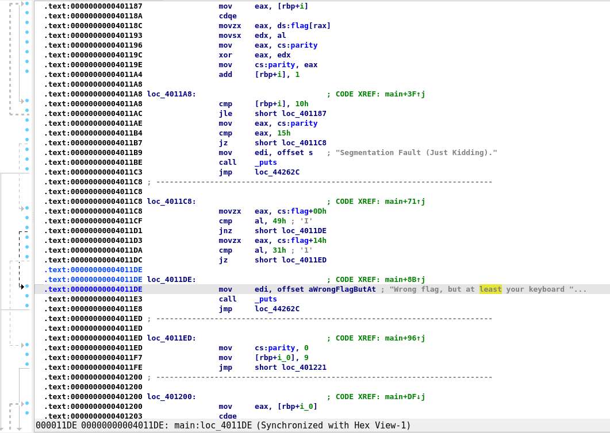
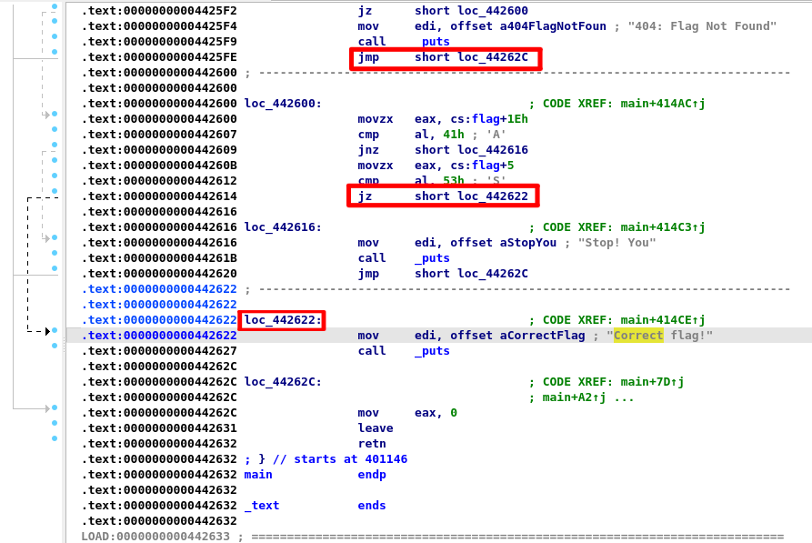
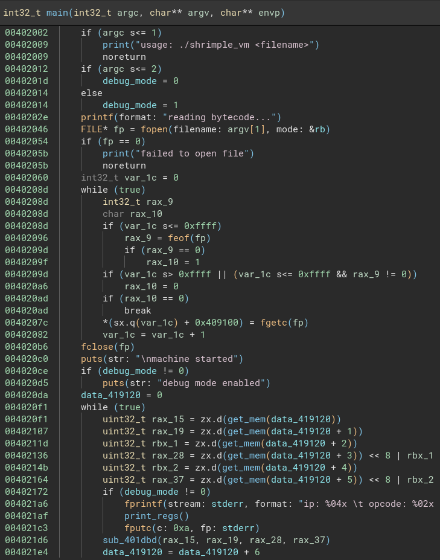
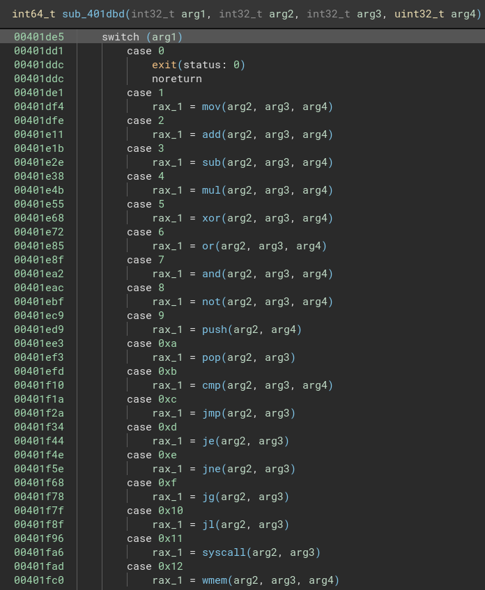

# pingCTF 2025 Writeups

We will be covering the reverse engineering challenges from the pingCTF 2025 competition. We were able to solve 3 out of 5 challenges and solved another one after the competition ended. Our team came 18th in the CTF.

## Uncertain 
> If you hate yourself try doing it manually. <br>
> [Attachment](./uncertain)

We are given a 512kB binary file which asks for a flag on execution. It performs a hell lot of checks and if at any point some check fails, it prints out some error and exits.

Opening it up in Binary Ninja, the decompiler doesn't even work because the main function is too large, so we need to analyse the disassembly instead. At this point I switched to IDA because disassembly is the strong suite of IDA just as decompilation is the strong suite of Binja. 
The main function as expected is huge (over 0x40000 lines). Going at the end of the main function (after a lot of disses at our skill level) we find the Correct flag address. 

Since I do not hate myself, I decided to use angr to automate the reversing. To those who are new to angr, [here](https://youtu.be/RCgEIBfnTEI?feature=shared) is a nice video explaining it. To get started, setup a virtual environment and install angr using pip. 
```bash
python3 -m venv angr
source angr/bin/activate
pip install angr
```
Then we can start writing the script. 
```python
import angr
import claripy

def main():
    # Load the binary
    proj = angr.Project('./uncertain', auto_load_libs=False)
    # Start of main
    entry_point = 0x401146
    # Address of "Correct flag"
    find_addr = 0x442622
    avoid_addr = [0x44262c]
```

Scrolling through the main function we notice that there is a flag global variable that is being used in the checks. Also notice that the maximum offset being checked is `flag+0x20`, so the flag must have a maximum length of 0x21 bytes. Also since the number of conditions is too large, I enabled lazy solving. I then directly pass the flag symbolic buffer to the address where it should be stored.
```python
    # Create a symbolic buffer for the flag
    flag_length = 0x21
    flag = claripy.BVS('flag', flag_length * 8, explicit_name=True)

    # Create a state with the entry point and enable lazy solving
    state = proj.factory.entry_state(addr=entry_point, add_options={angr.options.LAZY_SOLVES})

    buf = 0x446040  # Address of the flag buffer
    state.memory.store(buf, flag, endness='Iend_BE') # Store the flag in memory
    state.regs.rdi = buf  # Set RDI to the flag buffer if scanf uses it
```
Now I added the conditions to ensure that the flag is printable. 
```python
    # Add constraints to ensure the flag is printable
    for i in range(flag_length):
        state.solver.add(flag.get_byte(i) >= 0x20)
        state.solver.add(flag.get_byte(i) <= 0x7e)
```
Finally, we can create a simulation manager and run the simulation. 
```python
    # Create a simulation manager
    simgr = proj.factory.simulation_manager(state)

    # Explore the binary
    simgr.explore(find=find_addr, avoid=avoid_addrs)

    # Extract the found solution
    if simgr.found:
        found_state = simgr.found[0]
        flag_solution = found_state.solver.eval(flag, cast_to=bytes)
        print(f"[*] Found flag: {flag_solution.decode()}")
    else:
        print("[-] No valid flag found.")

if __name__ == "__main__":
    import logging
    logging.getLogger('angr.sim_manager').setLevel(logging.DEBUG)
    main()
```
This takes about 5 minutes to run and accumulates a lot of constraints. [Here](./uncertain.py) is the final script.
```bash
INFO     | 2025-04-08 11:58:58,699 | angr.sim_manager | Stepping active of <SimulationManager with 1 active, 5020 avoid>
INFO     | 2025-04-08 11:58:58,703 | angr.sim_manager | Stepping active of <SimulationManager with 1 active, 5020 avoid>
INFO     | 2025-04-08 11:58:58,708 | angr.sim_manager | Stepping active of <SimulationManager with 1 active, 5020 avoid>
INFO     | 2025-04-08 11:58:58,712 | angr.sim_manager | Stepping active of <SimulationManager with 1 active, 5020 avoid>
INFO     | 2025-04-08 11:58:58,715 | angr.sim_manager | Stepping active of <SimulationManager with 1 active, 5020 avoid>
INFO     | 2025-04-08 11:58:58,719 | angr.sim_manager | Stepping active of <SimulationManager with 1 active, 5020 avoid>
INFO     | 2025-04-08 11:58:58,723 | angr.sim_manager | Stepping active of <SimulationManager with 1 active, 5020 avoid>
INFO     | 2025-04-08 11:58:58,727 | angr.sim_manager | Stepping active of <SimulationManager with 1 active, 5020 avoid>
INFO     | 2025-04-08 11:58:58,731 | angr.sim_manager | Stepping active of <SimulationManager with 1 active, 5020 avoid>
INFO     | 2025-04-08 11:58:58,735 | angr.sim_manager | Stepping active of <SimulationManager with 1 active, 5020 avoid>
INFO     | 2025-04-08 11:58:58,739 | angr.sim_manager | Stepping active of <SimulationManager with 1 active, 5020 avoid>
INFO     | 2025-04-08 11:58:58,743 | angr.sim_manager | Stepping active of <SimulationManager with 1 active, 5020 avoid>
INFO     | 2025-04-08 11:58:58,747 | angr.sim_manager | Stepping active of <SimulationManager with 1 active, 5020 avoid>
INFO     | 2025-04-08 11:58:58,752 | angr.sim_manager | Stepping active of <SimulationManager with 1 active, 5020 avoid>
INFO     | 2025-04-08 11:58:58,754 | angr.sim_manager | Stepping active of <SimulationManager with 2 active, 5020 avoid>
INFO     | 2025-04-08 11:58:58,757 | angr.sim_manager | Stepping active of <SimulationManager with 2 active, 5020 avoid>
INFO     | 2025-04-08 11:58:58,760 | angr.sim_manager | Stepping active of <SimulationManager with 2 active, 5020 avoid>
INFO     | 2025-04-08 11:58:58,768 | angr.sim_manager | Stepping active of <SimulationManager with 2 active, 5020 avoid>
INFO     | 2025-04-08 11:58:58,772 | angr.sim_manager | Stepping active of <SimulationManager with 2 active, 5020 avoid>
INFO     | 2025-04-08 11:58:58,776 | angr.sim_manager | Stepping active of <SimulationManager with 2 active, 5021 avoid>
INFO     | 2025-04-08 11:58:58,780 | angr.sim_manager | Stepping active of <SimulationManager with 3 active, 5021 avoid>
INFO     | 2025-04-08 11:58:58,784 | angr.sim_manager | Stepping active of <SimulationManager with 4 active, 5021 avoid>
[*] Found flag: ping{S0_much_IF5_17_1s_4lm057_A1}
```

## baby-vm
> Just a shrimple VM, good for beginners. Hint: I was to lazy to remove debugging functions.<br>
> [shrimple_vm](./shrimple_vm) and [bytecode](./bytecode)

In this challenge we are given a custom VM implementation and corresponding bytecode. Opening it up in Binary Ninja, we can see that there the main function takes as argument a bytecode file and then loads it into the address `0x409100` character by character. The bytecode is then executed in a loop until the end of the file by taking 6 characters at a time.


Looking at the exec function, we can see that the first argument is the opcode the rest are the operands. (There is another opcode `0x13` corresponding to `rmem` which is not displyed in the screenshot). <br>


Each of the instructions themselves have some more switch-cases which check whether to execute something from the register or instruction memory or the stack. It took me a while to map out each instruction and its corresponding functionality. You can take a look at the [entire VM implemented in python](./vm.py). 

At this point since I know exactly how to parse the bytecode, I asked claude to generate a [python script](./parse.py) to parse the bytecode and give me an equivalent asm code file.

We roughly get the following asm code:
```asm
; Decompiled from bytecode file: bytecode
; Format: [label:] instruction operands
; Jump targets:
label_0000:  mov r7, 0
             mov r1, 2048
             add r1, r7
             syscall 0
             wmem [r1], r0
             add r7, 1
             cmp r7, 30
             jne label_0000
label_0030:  mov r7, 3
             sub r7, 1
             mov r0, 2075
             add r0, r7
             rmem r0, [r0]
             mov r1, 9035
             add r1, r7
             rmem r1, [r1]
             cmp r0, r1
             je label_0072
             mov r6, 4102
label_0072:  wmem [r6], 1
             cmp r7, 0
             jne label_0030
label_0084:  mov r7, 5
             sub r7, 1
             mov r0, 2048
             add r0, r7
             rmem r0, [r0]
             mov r1, 8000
             add r1, r7
             rmem r1, [r1]
             cmp r0, r1
             je label_00c6
             mov r6, 4100
label_00c6:  wmem [r6], 1
             cmp r7, 0
             jne label_0084
label_00d8:  mov r7, 30
             sub r7, 1
             mov r1, 2048
             add r1, r7
             rmem r0, [r1]
             cmp r0, 64
             jl label_011a
             cmp r0, 91
             jg label_011a
             add r0, 37
             mov r1, 8100
label_011a:  add r1, r7
             wmem [r1], r0
             cmp r7, 0
             jne label_00d8
label_0132:  mov r7, 30
             sub r7, 1
             mov r1, 2048
             add r1, r7
             rmem r0, [r1]
             cmp r0, 96
             jl label_0174
             cmp r0, 123
             jg label_0174
             add r0, 21
             mov r1, 8100
label_0174:  add r1, r7
             wmem [r1], r0
             cmp r7, 0
             jne label_0132
label_018c:  mov r7, 30
             sub r7, 1
             mov r1, 2048
             add r1, r7
             rmem r0, [r1]
             cmp r0, 47
             jl label_01ce
             cmp r0, 58
             jg label_01ce
             add r0, 112
             mov r1, 8100
label_01ce:  add r1, r7
             wmem [r1], r0
             cmp r7, 0
             jne label_018c
label_01e6:  mov r7, 30
             sub r7, 1
             mov r0, 8100
             add r0, r7
             rmem r0, [r0]
             mov r1, 8505
             add r1, r7
             rmem r1, [r1]
             cmp r0, r1
             je label_0228
             mov r6, 4098
label_0228:  wmem [r6], 1
             cmp r7, 0
             jne label_01e6
             mov r6, 0
label_0240:  mov r7, 8
             mov r5, 4096
             add r5, r7
             rmem r0, [r5]
             add r6, r0
             sub r7, 1
             cmp r7, 0
             jne label_0240
             cmp r6, 0
             je label_02d0
             mov r0, 87
             syscall 1
             mov r0, 114
             syscall 1
             mov r0, 111
             syscall 1
             mov r0, 110
             syscall 1
             mov r0, 103
             syscall 1
             mov r0, 10
             syscall 1
             mov r0, 0
             syscall 1
label_02d0:  exit
             mov r0, 67
             syscall 1
             mov r0, 111
             syscall 1
             mov r0, 114
             syscall 1
             mov r0, 114
             syscall 1
             mov r0, 101
             syscall 1
             mov r0, 99
             syscall 1
             mov r0, 116
             syscall 1
             mov r0, 10
             syscall 1
             exit
             exit
             ...
             exit
; Invalid opcode: 7b
             exit
             exit
             ...
             exit
; Invalid opcode: 7c
             exit
; Invalid opcode: a5
; Invalid opcode: 7b
; Invalid opcode: 8c
             exit
             ...
```
I then converted this into a more verbose and easier to understand but equivalent asm code. However, it took me a lot of time to understand how the expected value is being stored. It turns out that the value against which the checks are being performed were stored at the locations which say "Invalid opcode" in the disassembled bytecode. 
```asm
section .data
    correct_msg db "Correct", 0
    wrong_msg db "Wrong", 0
    memory_space: times 10000 db 0   ; Allocate space for our "memory"
    
    ; Pre-defined values for expected comparisons
    expected_values: times 30 db 0    ; Will be filled with expected values at 0x2139
    transformed_data: times 30 db 0   ; Space for transformed data at 0x1fa4

section .bss
    input_buffer: resb 30            ; Buffer for reading input

section .text
global _start

_start:
    ; Initialize memory with pre-defined values for testing
    ; We'll simulate the memory addresses from the pseudo-code
    
    ; Register mapping from pseudo-code to x86-64:
    ; r[0] -> rax
    ; r[1] -> rbx
    ; r[5] -> r8
    ; r[6] -> r9
    ; r[7] -> r10
    
    ; Initialize counter to 0
    mov r10, 0                      ; r[7] = 0
    
read_input_loop:
    ; Set memory base address
    mov rbx, memory_space + 0x800   ; r[1] = 800 (base address)
    add rbx, r10                    ; r[1] += r[7]
    
    ; Read character from input
    mov rax, 0                      ; syscall: read
    mov rdi, 0                      ; file descriptor: stdin
    lea rsi, [input_buffer + r10]   ; buffer to store input
    mov rdx, 1                      ; read 1 byte
    syscall
    
    ; Store input character in memory
    mov cl, byte [input_buffer + r10]
    mov [rbx], cl                   ; Store input character at memory location
    
    ; Increment counter
    inc r10                         ; r[7]++
    
    ; Compare counter with 30 (0x1e)
    cmp r10, 0x1e
    jne read_input_loop             ; Loop if not equal to 30
    
    ; First comparison check
    mov r10, 3                      ; Reset counter to 3
    
first_check_loop:
    ; Decrement counter
    dec r10                         ; r[7]--
    
    ; Set memory address for comparison
    mov rax, memory_space + 0x81b   ; r[0] = 0x81b
    add rax, r10                    ; r[0] += r[7]
    mov al, byte [rax]              ; Load value from memory address in r0
    
    ; Set another memory address
    mov rbx, memory_space + 0x234B  ; r[1] = 0x234B
    add rbx, r10                    ; r[1] += r[7]
    mov bl, byte [rbx]              ; Load value from memory address in r1
    
    ; Compare values
    cmp al, bl                      ; Compare r[0] and r[1]
    je first_check_equal            ; Jump if equal
    
    ; Set error flag if not equal
    mov r9, memory_space + 0x1006   ; r[6] = 0x1006
    
first_check_equal:
    ; Write to memory at address in r6
    mov byte [r9], 1                ; Memory[r6] = 1
    
    ; Check if counter is 0
    cmp r10, 0                      ; Check if r[7] is 0
    jne first_check_loop            ; Loop if counter not 0
    
    ; Second comparison check
    mov r10, 5                      ; Reset counter to 5
    
second_check_loop:
    ; Decrement counter
    dec r10                         ; r[7]--
    
    ; Set base address
    mov rax, memory_space + 0x800   ; r[0] = 0x800
    add rax, r10                    ; r[0] += r[7]
    mov al, byte [rax]              ; Read memory at address in r0
    
    ; Set another memory address
    mov rbx, memory_space + 0x1f40  ; r[1] = 0x1f40
    add rbx, r10                    ; r[1] += r[7]
    mov bl, byte [rbx]              ; Read memory at address in r1
    
    ; Compare values
    cmp al, bl                      ; Compare r[0] and r[1]
    je second_check_equal           ; Jump if equal
    
    ; Set error flag if not equal
    mov r9, memory_space + 0x1004   ; r[6] = 0x1004
    
second_check_equal:
    ; Write to memory at address in r6
    mov byte [r9], 1                ; Memory[r6] = 1
    
    ; Check if counter is 0
    cmp r10, 0                      ; Check if r[7] is 0
    jne second_check_loop           ; Loop if counter not 0
    
    ; First transformation - uppercase letters
    mov r10, 0x1e                   ; Reset counter to 30 (0x1e)
    
first_transform_loop:
    ; Decrement counter
    dec r10                         ; r[7]--
    
    ; Set base address
    mov rbx, memory_space + 0x800   ; r[1] = 0x800
    add rbx, r10                    ; r[1] += r[7]
    movzx rax, byte [rbx]           ; Read memory at address in r1
    
    ; Compare with '@' (ASCII 64)
    cmp rax, 0x40                   ; Compare with '@'
    jl first_transform_skip         ; Jump if less
    
    ; Compare with '[' (ASCII 91)
    cmp rax, 0x5b                   ; Compare with '['
    jg first_transform_skip         ; Jump if greater
    
    ; Add 37 to the ASCII value
    add rax, 0x25                   ; Add 37 to ASCII value
    
    ; Set destination address
    mov rbx, memory_space + 0x1fa4  ; r[1] = 0x1fa4
    
first_transform_skip:
    ; Add counter to address
    add rbx, r10                    ; r[1] += r[7]
    
    ; Write transformed character to memory
    mov byte [rbx], al              ; Memory[r1] = r[0]
    
    ; Check if counter is 0
    cmp r10, 0                      ; Check if r[7] is 0
    jne first_transform_loop        ; Loop if counter not 0
    
    ; Second transformation - lowercase letters
    mov r10, 0x1e                   ; Reset counter to 30 (0x1e)
    
second_transform_loop:
    ; Decrement counter
    dec r10                         ; r[7]--
    
    ; Set base address
    mov rbx, memory_space + 0x800   ; r[1] = 0x800
    add rbx, r10                    ; r[1] += r[7]
    movzx rax, byte [rbx]           ; Read memory at address in r1
    
    ; Compare with '`' (ASCII 96)
    cmp rax, 0x60                   ; Compare with '`'
    jl second_transform_skip        ; Jump if less
    
    ; Compare with '{' (ASCII 123)
    cmp rax, 0x7b                   ; Compare with '{'
    jg second_transform_skip        ; Jump if greater
    
    ; Add 21 to the ASCII value
    add rax, 0x15                   ; Add 21 to ASCII value
    
    ; Set destination address
    mov rbx, memory_space + 0x1fa4  ; r[1] = 0x1fa4
    
second_transform_skip:
    ; Add counter to address
    add rbx, r10                    ; r[1] += r[7]
    
    ; Write transformed character to memory
    mov byte [rbx], al              ; Memory[r1] = r[0]
    
    ; Check if counter is 0
    cmp r10, 0                      ; Check if r[7] is 0
    jne second_transform_loop       ; Loop if counter not 0
    
    ; Third transformation - numbers
    mov r10, 0x1e                   ; Reset counter to 30 (0x1e)
    
third_transform_loop:
    ; Decrement counter
    dec r10                         ; r[7]--
    
    ; Set base address
    mov rbx, memory_space + 0x800   ; r[1] = 0x800
    add rbx, r10                    ; r[1] += r[7]
    movzx rax, byte [rbx]           ; Read memory at address in r1
    
    ; Compare with '/' (ASCII 47)
    cmp rax, 0x2f                   ; Compare with '/'
    jl third_transform_skip         ; Jump if less
    
    ; Compare with ':' (ASCII 58)
    cmp rax, 0x3a                   ; Compare with ':'
    jg third_transform_skip         ; Jump if greater
    
    ; Add 112 to the ASCII value
    add rax, 0x70                   ; Add 112 to ASCII value
    
    ; Set destination address
    mov rbx, memory_space + 0x1fa4  ; r[1] = 0x1fa4
    
third_transform_skip:
    ; Add counter to address
    add rbx, r10                    ; r[1] += r[7]
    
    ; Write transformed character to memory
    mov byte [rbx], al              ; Memory[r1] = r[0]
    
    ; Check if counter is 0
    cmp r10, 0                      ; Check if r[7] is 0
    jne third_transform_loop        ; Loop if counter not 0
    
    ; Final validation
    mov r10, 0x1e                   ; Reset counter to 30 (0x1e)
    
validation_loop:
    ; Decrement counter
    dec r10                         ; r[7]--
    
    ; Set base address for transformed data
    mov rax, memory_space + 0x1fa4  ; r[0] = 0x1fa4
    add rax, r10                    ; r[0] += r[7]
    movzx rax, byte [rax]           ; Read memory at address in r0
    
    ; Set address for expected value
    mov rbx, memory_space + 0x2139  ; r[1] = 0x2139
    add rbx, r10                    ; r[1] += r[7]
    movzx rbx, byte [rbx]           ; Read expected value
    
    ; Compare transformed with expected
    cmp rax, rbx                    ; Compare r[0] and r[1]
    je validation_equal             ; Jump if equal
    
    ; Set error flag if not equal
    mov r9, memory_space + 0x1002   ; r[6] = 0x1002
    
validation_equal:
    ; Write to memory at address in r6
    mov byte [r9], 1                ; Memory[r6] = 1
    
    ; Check if counter is 0
    cmp r10, 0                      ; Check if r[7] is 0
    jne validation_loop             ; Loop if counter not 0
    
    ; Check for errors
    xor r9, r9                      ; r[6] = 0 (reset accumulator)
    mov r10, 8                      ; Set counter to 8
    
error_check_loop:
    ; Set base address for error flags
    mov r8, memory_space + 0x1000   ; r[5] = 0x1000
    add r8, r10                     ; r[5] += r[7]
    movzx rax, byte [r8]            ; Read error flag
    
    ; Add to accumulator
    add r9, rax                     ; r[6] += r[0]
    
    ; Decrement counter
    dec r10                         ; r[7]--
    
    ; Check if counter is 0
    cmp r10, 0                      ; Check if r[7] is 0
    jne error_check_loop            ; Loop if counter not 0
    
    ; Check if accumulator is 0 (no errors)
    cmp r9, 0                       ; Check if r[6] is 0
    je print_correct                ; Jump to "Correct" if no errors
    
    ; Print "Wrong" message
    mov rax, 1                      ; syscall: write
    mov rdi, 1                      ; file descriptor: stdout
    mov rsi, wrong_msg              ; message to write
    mov rdx, 5                      ; message length
    syscall
    jmp exit
    
print_correct:
    ; Print "Correct" message
    mov rax, 1                      ; syscall: write
    mov rdi, 1                      ; file descriptor: stdout
    mov rsi, correct_msg            ; message to write
    mov rdx, 7                      ; message length
    syscall
    
exit:
    ; Exit program
    mov rax, 60                     ; syscall: exit
    xor rdi, rdi                    ; exit code 0
    syscall
```

In a nutshell, the program is reading 30 characters from the input and storing them in memory. It then performs a series of transformations on the input characters based on their ASCII values. The transformed characters are then compared against expected values stored in memory. If all comparisons pass, it prints "Correct", otherwise it prints "Wrong".
The expected values are stored at the address `0x2139` and the transformed data is stored at `0x1fa4`.
Writing a python script to generate the correct input which matches these checks is now trivial. 
```python
expected_bytes = [
    0x85, 0x7e, 0x83, 0x7c, 0x90, 0x69, 0xa0, 0x00,
    0x8a, 0x00, 0x8a, 0x83, 0x79, 0xa3, 0x87, 0xa5,
    0xa7, 0xa4, 0x83, 0x79, 0x00, 0x7b, 0x72, 0xa5,
    0x00, 0x83, 0xa0, 0x8c, 0x00, 0x00
]

def is_printable(c):
    return (0x20 <= c <= 0x7F)

for idx, b in enumerate(expected_bytes):
    print(f"Byte {idx}: 0x{b:02x}")
    for offset, op_str in [ (0x15, "-0x15"), (0x25, "-0x25"), (0x70, "-0x70") ]:
        candidate = b - offset
        note = ""
        if is_printable(candidate):
            note = f"('{chr(candidate)}') [printable]"
        else:
            note = "(non-printable)"
        print(f"  {op_str}: 0x{candidate:02x} {note}")
```
Reading off the values from the output, we get the following flag:
```
ping{D0_u_und3r574nd_VM5_n0w?}
```

## cat detector
> [Attachment](./catdetectorpublic.zip)

In this challenge, we are given a server that runs a ML model. From the files given, we can quickly make out that our task is to upload an image whose encoded representation should somewhat resemble a particular vector closely (the threshold is total sum of squares over all elements of the vector should be 0.5).

```py
def is_kitten(f, eps=0.1):
    im = Image.open(f).convert("RGB")

    t_im = transform(im)

    t_im = t_im.unsqueeze(0)

    with torch.no_grad():
        pred = model(t_im).squeeze()

    dst = float(torch.norm(pred - torch.tensor(kitten_template).float()))
    return dst < eps
```

Now it is not possible to get back the original image from the given vector representation since there is a loss on information in the neural network during encoding. But no one asked us to input the original image itself!

Since we are given the model (ImageNet v1) and hence it's weights, we can start with a random noise image and try to use a gradient descent method to update the image appropriately so that the difference between the encoded representation of the image and the one we want becomes less than the threshold.

Now that we have an idea, it is pretty straightforward to generate a image from random noise that would give out a similar encoded representation.

First we load the model as they do in their code:
```py
weights = models.MNASNet0_5_Weights.IMAGENET1K_V1
model = models.mnasnet0_5(weights=weights)
model.eval()
model.classifier = torch.nn.Identity()

transform = weights.transforms() 

# The given encoded representation
kitten_template = [...]
```

Next we define our random starting image:
```py
generated_image = torch.randn(1, 3, 256, 256, device=device, requires_grad=True)
```

And finally initialize the loss function and the optimizer:
```py
loss_fn = torch.nn.MSELoss(reduction="sum")
optimizer = Adam([generated_image], lr=0.1)
```

Now we are all ready to start the gradient descent approach:
```py
eps_threshold = 0.48

i = 0
while True:
    optimizer.zero_grad()

    output = model(transform(generated_image))
    # loss = loss_fn(output.squeeze(), kitten_template)
    loss = torch.norm(output.squeeze() - kitten_template)

    loss.backward()
    optimizer.step()

    generated_image.data = torch.clamp(generated_image.data, 0.0, 1.0)

    if i % 100 == 0:
        print(f"Step {i}: loss = {loss.item()}")

    if loss.item() < eps_threshold:
        print("Success! Found an adversarial image that is considered a kitten.")
        break

    i += 1
```

Finally save the image to a file and submit it!
```py
final_img = generated_image.squeeze().detach().cpu()
# Permute from (C, H, W) to (H, W, C) and convert to numpy
final_img = final_img.permute(1, 2, 0).numpy()
final_img = (final_img * 255).astype(np.uint8)
img_pil = Image.fromarray(final_img)
img_pil.save("adversarial_kitten.png")
```

Submitting the generated image on the website finally gives us the flag!

## go-go-power-rangers

> https://www.youtube.com/watch?v=_ZeJvwuS4D0 <br>
> [Attachment](./go-go-power-rangers)

In this challenge we are given a go binary which asks for a flag and then prints out a message. 
```bash
└─$ ./go-power-rangers
2025/04/08 13:02:45 INFO prove you don't need no silly flags given straight out of the gate and GIVE ME THE FLAG!
Enter here:flag
panic: INTRUDER! RANGERS GET'EM

goroutine 1 [running]:
main.main()
        /home/tomek/Desktop/main.go:169 +0x1bd
```
Opening it up in IDA, we can see that the main function sets up the flag and then checks the input length with the expected length. After that it checks the input character by character by calling the `main_checkChar` function. If at any point this check fails, it prints out the error message and exits.
```
void main_main(){
 main_loadFlag(v10);
  len = p_string->len;
  if ( v4 != len )
LABEL_11:
    runtime_gopanic((unsigned int)&RTYPE_string, (unsigned int)&off_551128, v11, 1, v5, v12, v13, v14, v15, v22, v23);
  v25 = p_string->len;
  ptr = p_string->ptr;
  v26 = p_string->ptr;
  for ( i = 0LL; i < len; i = v5 )
  {
    v19 = (unsigned __int8)ptr[i];
    if ( v19 >= 0x80 )
    {
      v24 = i;
      v20 = runtime_decoderune((_DWORD)ptr, len, i, 1, v5, v12, v13, v14, v15, v22);
      LODWORD(i) = v24;
      v19 = v20;
      v5 = len;
    }
    else
    {
      v5 = i + 1;
    }
    if ( !(unsigned __int8)main_checkChar(v19, i, i, 1, v5, v12, v13, v14, v15, v22, v23) )
    {
      runtime_gopanic((unsigned int)&RTYPE_string, (unsigned int)&off_551128, v21, 1, v5, v12, v13, v14, v15, v22, v23);
      goto LABEL_11;
    }
    ptr = v26;
    len = v25;
  }
}
```
First we find out the length by breaking at the length check instruction and figure out that the expected length is 0x2e. Now we can either reverse engineer the `main_checkChar` function, which loads SHA512 keys and Ed25519Keys and performs some complex operations or we can just brute force the input. I decided to brute force the input since we get immediate feedback on each character. 
```python
from pwn import *
import string
import time

alphabet = string.printable

r = process('gdb go-power-rangers', shell=True)
r.sendline(b'b *0x4db354')
r.recvuntil(b'pwndbg>')
r.recvuntil(b'pwndbg>')

flag = ''
while len(flag) < 0x2e:
    for c in alphabet:
        correct = True
        for _ in range(3):
            r.sendline(b'r')
            r.sendline((flag + c + '?' * (0x2e - len(flag) - 1)).encode())
            for _ in range(len(flag)):
                assert b'hit Breakpoint 1' in r.recvuntil(b'pwndbg>')
                r.sendline(b'c')
            # Break on the unknown character and check if rax == 1
            assert b'hit Breakpoint 1' in r.recvuntil(b'pwndbg>')
            r.sendline(b'p/x $rax')
            correct &= b'= 0x1' in r.recvuntil(b'pwndbg>')
            if not correct:
                break
        if correct:
            flag += c
            print(flag)
```
This script runs the binary in gdb and sets up a breakpoint after the main_checkChar function. It then tries out each printable character and checks if the return value in rax is 1. If it is, we try it again multiple times to ensure that it is not a false positive. If it is not a false positive, we add the character to the flag and print it out. This script takes about 15 minutes to run and gives us the flag:
```ping{d1D_y0U_m4n4g3_G0_or_d1d_Y0u_w3nt_m4m4G3}```

